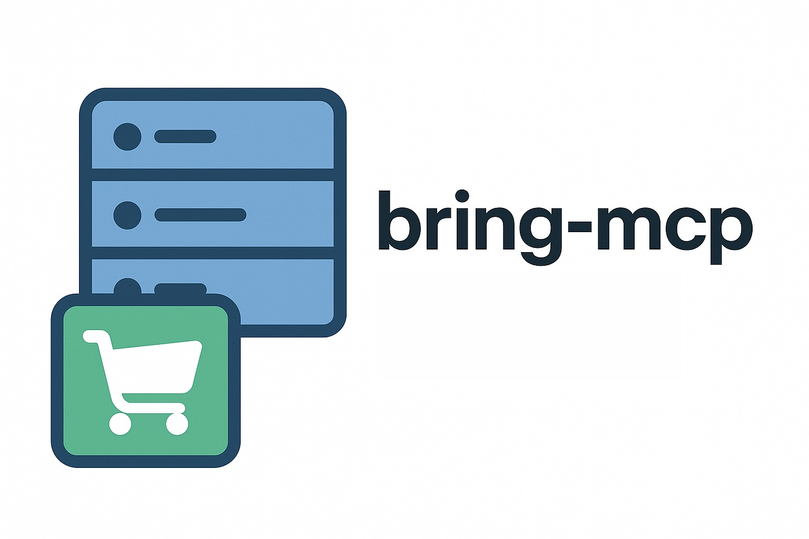

# bring-mcp-catalog



An MCP (Model Context Protocol) server for **Bring!** shopping lists, in TypeScript.

This is a derivative of **[florianwittkamp/bring-mcp](https://github.com/florianwittkamp/bring-mcp)**
by Florian Wittkamp, MIT licensed, and it would not exist without that project.
It keeps all 16 of the original tools and adds 11 more, built around one idea:

> Bring! stores an item by a **canonical, language-independent id** (`Äpfel`,
> `Kartoffeln`) and each client renders that id in the list's own language. An
> item saved as free text ("Apples" / "Maçãs") is stuck without an icon forever.
> The same item saved as `Äpfel` shows as "Maçãs" to a Portuguese phone, "Apples"
> to an English one, and carries the right icon and aisle for free.

So this fork resolves what you type against Bring's real catalog, in any of the
indexed languages, and saves the canonical id when it is confident enough.

---

**[Changelog](CHANGELOG.md)** · **[Contributing](CONTRIBUTING.md)** · **[Security](SECURITY.md)** · **[Releases](https://github.com/SpellsPT/bring-mcp-catalog/releases)**

## ⚠️ Status, and please read this bit

**This was vibe-coded. Use it entirely at your own risk.**

It was built fast, conversationally, with heavy AI assistance, by someone who is
not a professional developer. It has not been audited by anyone qualified to
audit it. It talks to an **unofficial, reverse-engineered API** and it **writes
to a real shopping list that other people can see**.

I take no responsibility for anything it does: not for wrong items, wrong icons,
deleted entries, corrupted lists, a blocked Bring! account, or anything else.
There is no warranty of any kind, express or implied, including merchantability
and fitness for a particular purpose. Nothing here is supported, and no fix is
promised. If it breaks something you care about, that is your problem, and you
accepted that by running it. This is the standard MIT position (see `LICENSE`),
stated plainly so nobody is surprised by it.

In fairness, the code has been through a fair amount of adversarial review and
carries 200+ tests — but "reviewed a lot" is not "safe", and none of that changes
a word of the paragraph above. **Try it on a list you do not care about first.**

Issues and pull requests are welcome, and I read them when I can. That is not a
commitment to fix, merge, or reply.

> **Also, as the original project says:** not affiliated with Bring! Labs AG in
> any way. The unofficial API may change or be blocked at any time, which could
> stop this working without notice.

---

## ✨ What this adds over the original

- **Catalog resolution** — turn a phrase in any indexed language into Bring's
  canonical item id, so items render correctly in every household member's
  language, with icons and aisles.
- **A deliberately conservative matcher** — it refuses to guess. Ambiguous
  queries (`paprika` is two different real catalog items) resolve to nothing
  rather than to a coin flip, on the principle that **a wrong icon is worse than
  no icon, because nobody goes looking for it.**
- **Icons and sections** — read, set and clear the per-item customisations that
  the Bring! apps show.
- **Rename** — carrying the item's specification and its icon across the rename.
- **Loud failures instead of silent no-ops** — the underlying API answers `204`
  whether or not a name matched, so a typo used to look like success. Names are
  verified before every destructive write.
- **Correct request encoding** — the upstream `bring-shopping` package builds
  request bodies by string concatenation with no escaping, so `Fish & Chips` was
  silently stored as `Fish`, and `50% Cream` never arrived at all. Fixed here.

### New tools

`saveItemResolved`, `findCatalogItem`, `findCatalogSection`, `setItemIcon`,
`setItemSection`, `listItemCustomisations`, `removeItemCustomisation`,
`renameItem`, `batchUpdateItems`, `setListArticleLanguage`, `bringApiRaw`

Everything from the original is still present and still works.

---

## 📦 Install

This project is not on npm. Install it from GitHub — it takes a minute:

```bash
git clone https://github.com/SpellsPT/bring-mcp-catalog.git
cd bring-mcp-catalog
npm ci
npm run build
cp .env.example .env
chmod 600 .env        # it holds your Bring! password
```

Then edit `.env`:

```env
BRING_EMAIL=your_email@example.com
BRING_PASSWORD=your_password
BRING_MCP_CATALOG_LOCALES=de-DE,en-US   # see "Configure your languages" below
```

The server reads `.env` from its own install directory, so it works no matter
which directory your MCP client starts it from. Anything your client passes in
its own `env` block takes precedence over the file. To keep the file somewhere
else, point `BRING_MCP_ENV_FILE` at it.

Now add it to your MCP client. For Claude Desktop, in `claude_desktop_config.json`:

```json
{
  "mcpServers": {
    "bring": {
      "command": "node",
      "args": ["/ABSOLUTE/PATH/TO/bring-mcp-catalog/build/src/index.js"]
    }
  }
}
```

Any MCP client that can launch a stdio server works the same way: the command is
`node /ABSOLUTE/PATH/TO/bring-mcp-catalog/build/src/index.js`.

**Updating:** `git pull && npm ci && npm run build`, then restart your MCP client.

> `MAIL` and `PW`, the variable names older versions used, are still accepted.

---

## 🚀 Features

- **Automatic Authentication**: No manual login required - authentication happens automatically on first API call
- Exposes Bring! API functions as MCP tools:
  - 🧾 Load shopping lists
  - 🛒 Get and modify items (add, remove, move)
  - 📦 Batch operations (save multiple items, delete multiple items)
  - 🖼 Save/remove item images
  - 👥 Manage list users
  - 🎯 Get default shopping list UUID
  - 🌐 Load translations & catalog
  - 📨 Retrieve pending invitations
- Communicates via STDIO (for use with Claude Desktop or MCP Inspector)
- Every tool declares its input and output schema and read-only / destructive hints
  (MCP SDK v2), and returns structured results alongside a readable text summary
- Supports Bring! credentials via `.env` file or injected environment variables

### Available Tools

**From the original project**

- **`loadLists`** — load all shopping lists
- **`getItems`** — all items on a list
- **`getItemsDetails`** — raw per-item detail records
- **`saveItem`** — add an item, with an optional specification
- **`saveItemBatch`** — add several items in one call
- **`removeItem`** — remove an item (verifies the name exists first)
- **`moveToRecentList`** — mark an item bought
- **`deleteMultipleItemsFromList`** — remove several by name, reporting misses
- **`saveItemImage`** / **`removeItemImage`** — per-item photo
- **`getAllUsersFromList`** — who shares the list
- **`getUserSettings`** — settings for the authenticated user
- **`getDefaultList`** — the default list's uuid
- **`loadTranslations`** — Bring!'s UI translations
- **`loadCatalog`** — the raw item catalog for a locale
- **`getPendingInvitations`** — outstanding list invitations

**Added here**

- **`saveItemResolved`** — the main one. Resolves your phrase against the
  catalog and stores the canonical id when confident, otherwise stores your text
  verbatim and attaches the closest icon, otherwise stores your text alone. It
  tells you which of the three happened.
- **`findCatalogItem`** / **`findCatalogSection`** — search the catalog, with
  scores, so you can see why something matched before you write anything.
- **`setItemIcon`** / **`setItemSection`** — set an item's icon or aisle.
- **`listItemCustomisations`** — every icon/section/image override on a list,
  rendered in a human language rather than as German canonical ids.
- **`removeItemCustomisation`** — drop an item's overrides.
- **`renameItem`** — rename, carrying the specification and the icon across.
- **`batchUpdateItems`** — mixed add / mark-bought / remove in one call.
- **`setListArticleLanguage`** — which language the list renders in.
- **`bringApiRaw`** — an escape hatch onto the raw API for probing undocumented
  endpoints. Off unless `BRING_MCP_RAW=1`, and when on it allows every verb,
  including DELETE — enable it only while exploring, never on an assistant.

---

## 🌍 Configure your languages first

**This is the one setting that matters.** Catalog resolution can only match a
language it has indexed, so out of the box it indexes `de-DE` and `en-US`:

```bash
BRING_MCP_CATALOG_LOCALES=de-DE,pt-BR,en-US   # a Portuguese/English household
BRING_MCP_CATALOG_LOCALES=de-DE,fr-FR         # a French one
```

`de-DE` is always included whether you list it or not — Bring's canonical item
ids _are_ the German names, so indexing German is what makes an exact id match
work. An unsupported locale throws at startup rather than being skipped, so a
typo is loud instead of quietly giving you a matcher that never recognises your
words. Supported locales are listed in `src/catalog.ts`.

Optionally, `BRING_MCP_DESCRIBE_LOCALE` sets the language
`listItemCustomisations` renders in; it defaults to the first indexed locale
that is not German.

---

## 🏃 Running and debugging

Start it by hand to check your credentials:

```bash
node build/src/index.js
```

It prints `MCP server for Bring! API v<version> is running on STDIO` on `stderr` and
waits for a client. To poke at the tools interactively, use the MCP Inspector:

```bash
npx @modelcontextprotocol/inspector node /ABS/PATH/bring-mcp-catalog/build/src/index.js
```

---

## 🔧 Development

### Testing

Run tests with:

```bash
npm run test
```

This command runs formatting, linting, and Jest tests with coverage reporting.

For CI testing:

```bash
npm run test:ci
```

### Building

Build the project:

```bash
npm run build
```

### Key Dependencies and Tools

- `@modelcontextprotocol/server` (MCP SDK v2): the MCP server implementation
- `@modelcontextprotocol/inspector`: Run on demand with `npx` for testing and debugging MCP servers
- `bring-shopping`: Node.js wrapper for the Bring! API
- `zod`: For schema definition and validation
- `dotenv`: For managing environment variables

---

## ✅ Final Notes

- 🔒 Avoid committing your `.env` file.
- 🧼 Keep credentials out of version control.
- 🛠 MCP Inspector is invaluable for debugging.
- 🔄 Authentication is handled automatically - no manual login required.
- 📦 Use batch operations for efficiency when working with multiple items.

Happy coding with MCP and Bring! 🎉
